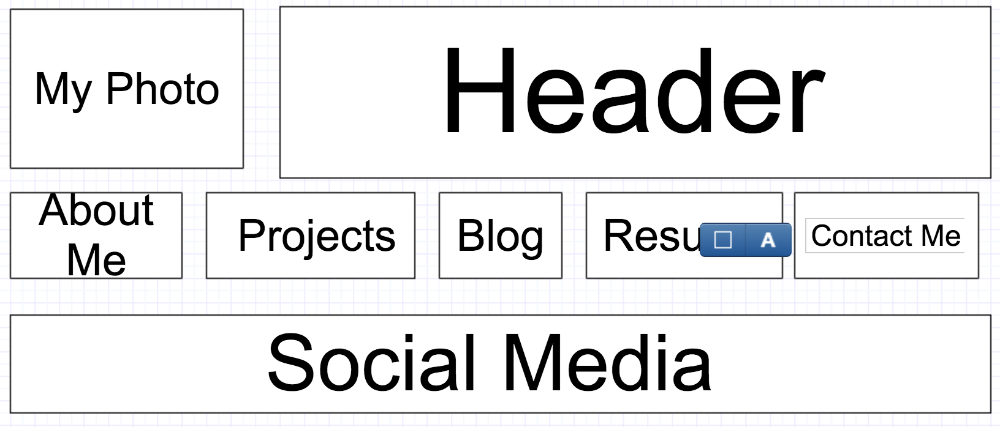
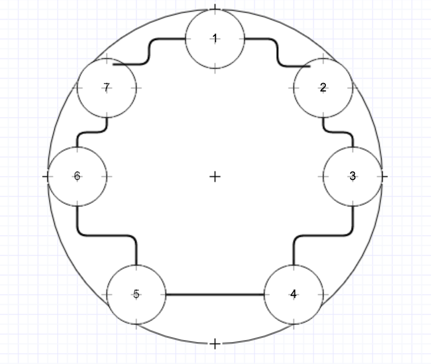

**What is a wireframe?**
  A wireframe is a visual skeleton of what a webpage will look like. It is a tool for designers to get an idea for the look and flow of the webpage, and how the user will interact with the page as well.

**What are the benefits of wireframing?**
  Wireframing is a quick way to view and edit different layouts for a webpage. With a wireframe, designers can move boxes around easily without having to redraw or erase pictures.

**Did you enjoy wireframing your site?**
  I did! It was fun to play with different layouts and flows of content. I moved titles around on my navigation bar to group them according to related content like "resume" and "contact me".

**Did you revise your wireframe or stick with your first idea?**
  My blog index took me a few minutes. I experimented with cascading, chronological flows of posts and eventually landed on a circle that flowed in a clockwise direction. I thought of what my blog posts would contain and if they would be chronological posts or not. I wanted the look of the page to reflect the content.

**What questions did you ask during this challenge?**
  What will my blog posts consist of? Will my posts be chronological in nature? Who will view my page? Where should my photo go? Am I the main focus, or is my content?

**What resources did you find to help you answer them?**
  I looked up social media profiles to see where photos were placed. I searched my mind and found that I enjoy telling stories, so it is likely my blog posts will be progressive and build on each other. These questions were quick and relatively easy to answer. My content will definitely be the focus, as that is my selling point, and I will have a robust About Me section, too.

**Which parts of the challenge did you enjoy and which parts did you find tedious?**
  I enjoyed making the wireframes themselves, and thinking about what my site would look like as I was doing it. I find the reflection a little tedious, but it does help cement my ideas and feelings.