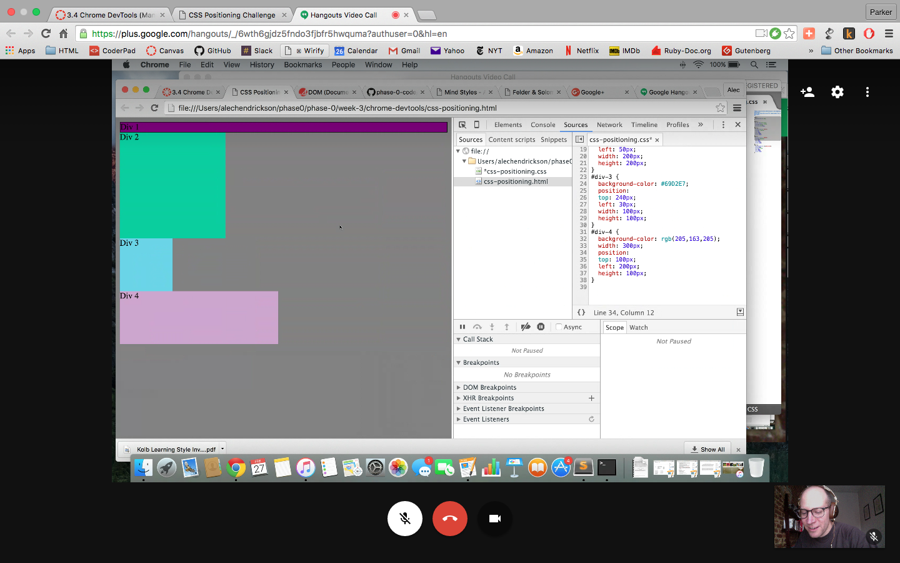
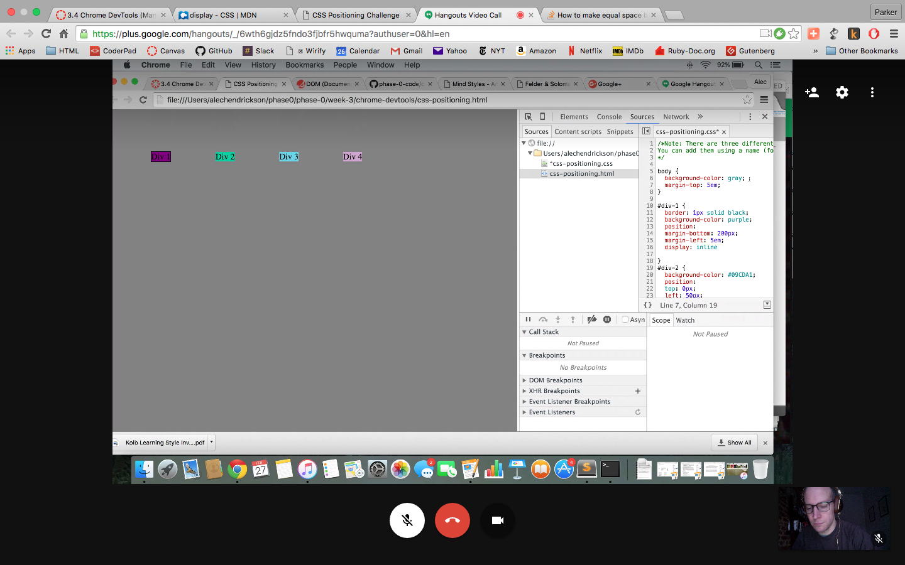
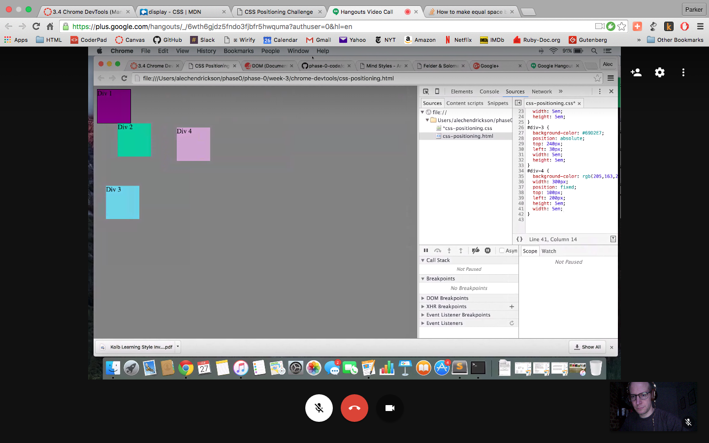

**How can you use Chrome's DevTools inspector to help you format or position elements?**
  I get to see any changes I make in real time, so I can make a change and quickly decide whether to save it or keep changing.

**How can you resize elements on the DOM using CSS?**
  There seem to be a few ways that I don't understand. Sometimes I changed the position of an object and the size of it changed. I know that the size can be changed using _width_ and _height_ specifications.

**What are the differences between absolute, fixed, static, and relative positioning? Which did you find easiest to use? Which was most difficult?**
  Fixed leaves the element in place. Relative lays out an element as if it were not positioned, then it adjusts the element's position without changing the layout. I do not fully understand the positioning values.

**What are the differences between margin, border, and padding?**
  Padding changes the space between the content of a div and the outer rim of that same div. Margin changes the position of a div relative to the HTML container, and border changes the spaces relative to the viewscreen.

**What was your impression of this challenge overall? (love, hate, and why?)**
  CSS is weird. I liked going through this challenge, but I did not feel like I knew what was going on when we changed things. It felt right at the time, and I thought I understood it, but reflecting on the definitions and why I made certain decisions, I couldn't tell you up from down. I'll have to read my textbook.