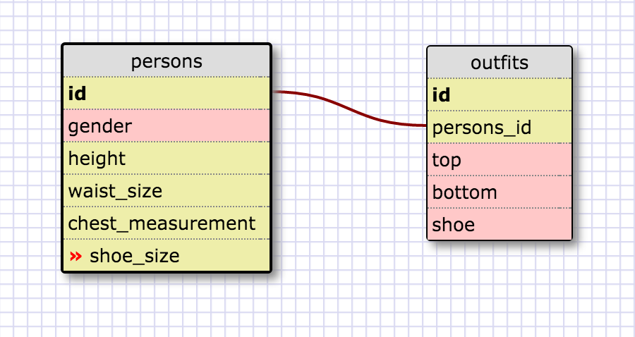

1.) SELECT * FROM states;

2.) SELECT * FROM regions;

3.) SELECT state_name, population FROM states;

4.) SELECT state_name, population FROM states
    ORDER BY population DESC;

5.) SELECT state_name FROM states WHERE region_id = 7;

6.) SELECT state_name, population_density FROM states
   ...> WHERE population_density > 50
   ...> ORDER BY population_density ASC;

7.) SELECT state_name FROM states
   ...> WHERE population BETWEEN 1000000 AND 1500000;

8.) SELECT state_name, region_id FROM states
   ...> ORDER BY region_id ASC;

9.) SELECT region_name FROM regions
   ...> WHERE region_name LIKE '%Central';

10.) SELECT region_name, state_name FROM states
   ...> JOIN regions ON regions.id = states.region_id
   ...> ORDER BY regions.id;

**Reflection**

**What are databases for?**
  Databases are for storing a lot of information, and for grouping that information in relevant groups while connecting those groups so that any related information is easily accessible.

**What is a one-to-many relationship?**
  When there are many pieces of data that all "fit" nicely into one category. For example, many novels may fit into one genre, or many genres may fit for one author, or many authors may fit under one publisher.

**What is a primary key? What is a foreign key? How can you determine which is which?**
  A primary key is a column of values in a table that hold a unique value for each row in the table. A foreign key is a column of values in a table, where each value uniquely references a row (the primary key) in another table. Foreign keys should be in the "many" table when there is a one-to-many relationship.

**How can you select information out of a SQL database? What are some general guidelines for that?**
  We can select information from a SQL database by columns, and order it how we like. We can select information by relating tables to each other using JOIN commands.