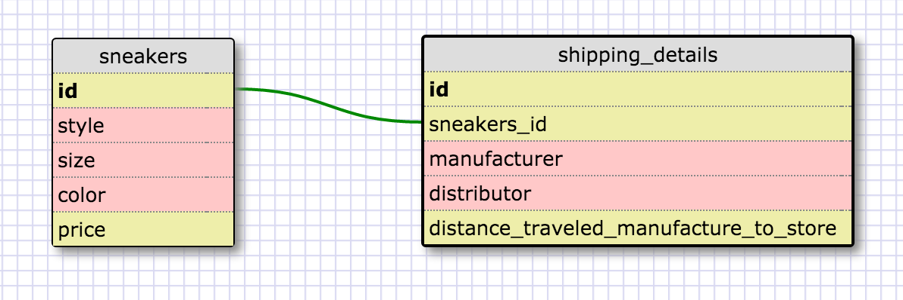
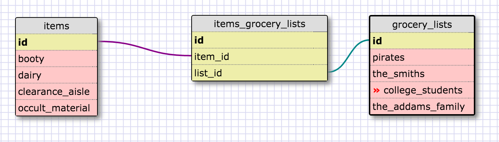

Sneakers can be manufactured en masse and/or individually per customer request. There are certain attributes of the sneaker that are readily important for the average query. The attributes I used reflect what an average consumer might search for when looking for a shoe. Each shoe holds much more information about its origin if we know what questions to ask. Where was it manufactured? How far did it travel to get to its destination? What were the material costs per shoe? We can store these per-unit details in a different table because they will likely not be asked for as often as the more aesthetic specifications.

**REFLECTION**

**What is a one-to-one database?**
  A one-to-one database is a relationship between two tables where one row in the first table relates to only one row in the other table.

**When would you use a one-to-one database? (Think generally, not in terms of the example you created).**
  When there are certain details about one table that do not need to be accessed often, we can use a one-to-one database to reduce the strain on the query by accessing less information, and only the information that is needed most often.

**What is a many-to-many database?**
  A many-to-many database is a relationship between multiple tables where one table contains multiple rows that may relate to multiple rows in another table. Put another way, one table may contain rows of information that would prove true for another table.

**When would you use a many-to-many database? (Think generally, not in terms of the example you created).**
  When there are common grounds with diverse products/information/things that many different people visit and interact with, and the different things are enjoyed by many different people.

**What is confusing about database schemas? What makes sense?**
  The concepts of databases schemas make sense. I think grouping things by relativity comes naturally to me. I had to backtrack a couple times during the reflection because I thought the fields referred to rows rather than columns. I had to go back and generalize a bit more in the tables, which was a quick fix. We can build tables and relationships like modular trees--generalizing or specifying as broadly or as minutely as we like.